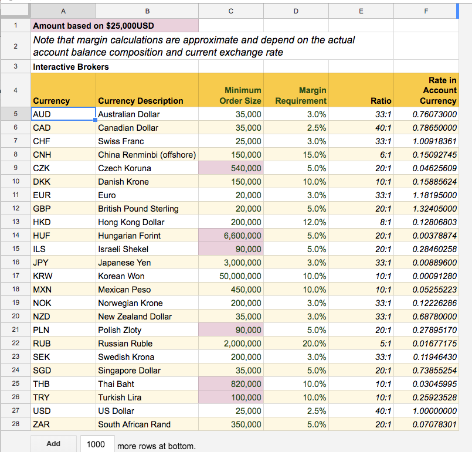

# Forex Helper Sheet

A *Google Sheets* spreadsheet to help visualize spreads and margins for prospective FOREX trades.

Optionally creates a *basket* of trades for importing into [Interactive Brokers TWS platform](https://www.interactivebrokers.com/en/index.php?f=14099).

## Getting Started

These instructions will get you a copy of the spreadsheet up and running in your own Google account. 

At present, this *only* exists for Google Sheets. There is no LibreOffice or Excel version available.

### Prerequisites

You need a Google account to make a copy of this spreadsheet and store it in your Google drive.

An Interactive Brokers account is *not* required.

### Installing

1. Grab a copy of the [latest version of the spreadsheet here](https://docs.google.com/spreadsheets/d/1_mdK-iLpd0A2dC96Gan9DXO_cHgRDBigviGmSUVE7s4/copy)
2. Google will ask for your authorization the first time you open the sheet. This is normal and nothing to be worried about. The sheet can not modify your Forex account in any way. If you are at all unsure, you can review the source code here in GitHub.


>**Disclaimer**: This spreadsheet comes with no warranty whatsoever. If you use it as an aid in your Forex trades, or elsewhere, you do so completely at your own risk.

## Configuration

### Warning Levels

Choose the *Config* sheet and set the following values according to your own preferences. 


The only required configuration option is the *Base Currency* which can be changed at any time.

The warning and maximum thresholds are purely informational and not required. 

Variable | Value | Notes
--- | --- | ---
Risk Warning (Account Currency) | 300 | Risk amounts greater than this level (in account currency) are highlighted in yellow
Risk Maximum (Account Currency) | 500 | Risk amounts greater than this level (in account currency) are highlighted in red
Margin Warning | 2,000 | Margin requirements greater than this level (in account currency) are highlighted in yellow
Margin Maximum | 3,000 | Margin requirements greater than this level (in account currency) are highlighted in red
Reward:Risk Warning | 1.5 | Reward to Risk ratios less than this level are highlighted in yellow
Reward:Risk Minimum | 1.0 | Reward to Risk ratios less than this level are highlighted in red
Account Currency | USD | Currency to calculate margins against and convert spreads, risks and rewards to.

An example using the value above could look something like this:

- In the second trade line, the margin requirement of $2,389 is highlighted yellow, representing a warning level as it is greater than the $2,000 warning level defined above.
- In the fourth trade line, the Reward:Risk ratio of 3.5 is highlighted in green as it is greater than the threshold of 1.5 defined above.


As mentioned previously, these levels are completely optional. If you don't wish to have highlighting, you can simply set them to arbitrarily high or low values. They are helpful however even as a typo-catching mechanism -- it's very easy to accidentally add an extra zero or reverse the stop loss and profit taking levels.


### Trade Sizes

Choose the *Broker* sheet to configure the standard lot sizes and margin requirements for each currency.



The **minimum order size** can be:

 - The minimum your broker considers to be a *lot*. Trading less than this amount will usually mean you will not get filled at the market price. 
 - Your preferred lot size. There is a multiplier on the actual *entry* sheet. So if you define a lot size (minimum order) as 50,000 and you enter a trade as 3 lots, the sheet will use 150,000 as your trade size.

The margin requirement is used for margin calculations in the *entry* sheet. Note that depending on the broker and your particular account type and composition, the margin calculations can get quite complicated. This spreadsheet uses a simple approach to give you a rough guide. The formula is:

```
=arrayformula(vlookup(D5:D,BrokerRequirements,4)*K5:K*GOOGLEFINANCE("CURRENCY:"&$D5:D&AccountCurrency))

or in English:

(Trade Size) * (Margin Requirement) * (Account Currency Exchange Rate)
```

## Operation

The *Entry* sheet is where all trades are entered and analysed. The important areas and functions are as follows:


### Buttons (1)

 The group of 3 blue buttons, toggles the visibility of the various currencies (items #7, #8 and #9). This is useful to de-clutter the screen when you only want to focus on your base currency for example.

 The *Generate Basket* button will [create a CSV file](#order-basket) suitable for importing into Interactive Brokers TWS platform.
 
 The *Archive Inactive* button will move all trade lines that are marked *Expired, Cancelled, Closed* etc to the *Archive* sheet. This is not reversible.
 
 The *Live Chart* button will pop up a chart of all the *active* trade lines.
 
### *Forex* Menu (2)

 Menu options exist for each of the buttons [listed above](#buttons-1).

### Trade Parameters (3)

 The columns in the *trade parameters* section are the only ones editable (the rest are calculated). The columns are defined as:

Column | Description
----- | -----
Status | A fixed list of statuses used to separate trades. See below for the complete list.
Source |  *Optional*. A mnemonic or other key to segregate orders. You may use different algorithms for example to generate trade ideas -- each one with a different "key". 
Date | The date of the trade idea, not necessarily the execution date.
Base | The *base* currency -- the first currency of the pair, eg. _**EUR**_.USD
Quote | The *quote* currency -- the second currency of the pair, eg. EUR._**USD**_
Order | BUY or SELL
Lot | How many lots to trade. The lot size is defined in the [*Broker* sheet](#trade-sizes) (see above).
Entry | Entry price
Stop Loss | Stop loss price
Target Price | Target (profit) price

Order Status | Can be Archived? | Can Add to Basket? | Notes
----- | ----- | ----- | -----
Pending | No | Yes | Only trades in *Pending* status will be selected to generate a *TWS Basket Order* (See below)
Submitted  | No | No | An informational status only. Has no effect.
Working | No | No | An informational status only. Has no effect within the spreadsheet
Closed - Profit | Yes | No | These trades will be archived when the *Archive Inactive* button is clicked.
Closed - Loss | Yes | No |These trades will be archived when the *Archive Inactive* button is clicked.
Expired | Yes | No |These trades will be archived when the *Archive Inactive* button is clicked.
Cancelled | Yes | No |These trades will be archived when the *Archive Inactive* button is clicked.

### Order Size (4)

Order sizes are calculated base on the broker minimums or lot sizes that you have configured (see above) and the Lot column from the [trade parameters section](#trade-parameters-3) (above).

The formulas are as follows:

```
Base Size = (Broker Minimum Size) * (Lot)
Quote Size = (Base Size) * (Entry Price)
Account Size = (Base Size) * (Current Exchange Rate to Account Currency)
```

### Margin Requirement (5)

The margin requirement is an approximation bases on the following simple formula:

```
=arrayformula(vlookup(D5:D,BrokerRequirements,4)*K5:K*vlookup(D5:D,BrokerRequirements,6))

or in English:

(Broker Margin Rate) * (Trade Size) * (Current Exchange Rate to Account Currency)
```

### Reward:Risk (6)

Reward to risk ratios are simple calculations:

```
Reward Spread = (Target price) - (Entry Price)
Ratio = (Reward Spread) / (Risk Spread)
Risk Spread = (Stop Loss Price) - (Entry Price)
```
Note that all calculations use *absolute values* (no negatives).

### Account Currency (7)

The same calculations as above but expressed in the account's currency. [See configuration section](#configuration).

### Base Currency (8)

The same calculations as above but expressed in the base currency (first currency in the pair). 

### Quote Currency (9)

The same calculations as above but expressed in the quote currency (second currency in the pair).

## Order Basket

If you have the Interactive Brokers TWS platform, you can generate a *basket trader* import file with one click.

1. On the *Entry* sheet, make sure you have at least one trade row in *pending* status. The sheet will not generate basket orders for any other status as it assumes they have already been processed through TWS.

2. Click the *Generate Basket* button at the top, (or the *Generate Basket* menu item under *Forex).

3. The *Basket* sheet tab will be selected and you should see something like this:


The first line contains a clickable URL to the basket file in CSV format. Clicking it will download the file to your computer. 

Each column refers to a field as [specified by TWS](https://www.interactivebrokers.com/en/software/tws/usersguidebook/specializedorderentry/basket_fields.htm). 

To import it into TWS, open the *BasketTrader* window, click *Browse* to find the file you downloaded above and then click *Load*.


Using BasketTrader is beyond the scope of this document. Interactive Brokers has some resources:

- [TWS Basket Trader Webinar Notes](https://www.interactivebrokers.com/en/index.php?f=736)
- [Basket Trader](https://www.interactivebrokers.com/en/index.php?f=579)

There is one caveat. You **must** configure TWS to display and trade in 1/10 of a pip instead of 1/2. The file that is generated from ForexHelper uses 1/10 precision by default and TWS BasketTrader will reject the orders if not configured properly.


## License

Copyright &copy; 2017 Codesmith Co.

Licensed under the Apache License, Version 2.0 (the "License"); You may not use these files except in compliance with the License. You may obtain a copy of the License at

http://www.apache.org/licenses/LICENSE-2.0

Unless required by applicable law or agreed to in writing, software
distributed under the License is distributed on an "AS IS" BASIS,
WITHOUT WARRANTIES OR CONDITIONS OF ANY KIND, either express or implied.
See the License for the specific language governing permissions and
limitations under the License.
